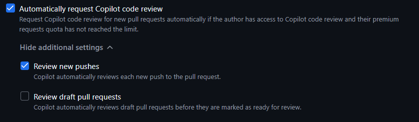
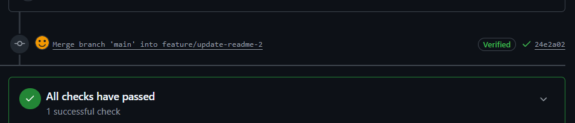
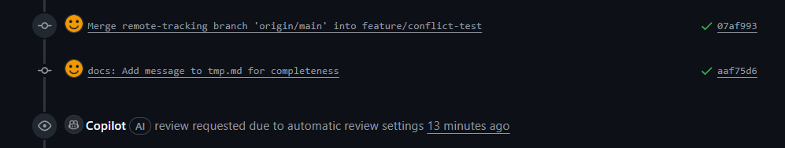

# POC Copilot review Automation

This repository is designed to verify the automation of Copilot reviewer settings.

Note: Enabling 'Review new pushes' ensures that Copilot reviews the Pull Request automatically upon every new push.

Observation: Copilot did not automatically review the changes after resolving conflicts and committing.

(Verified as of 2025/12/03)
